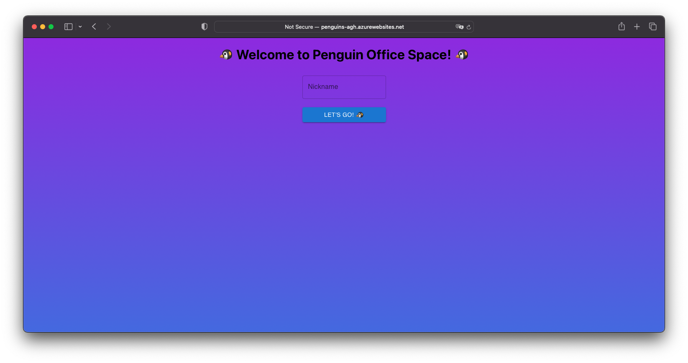
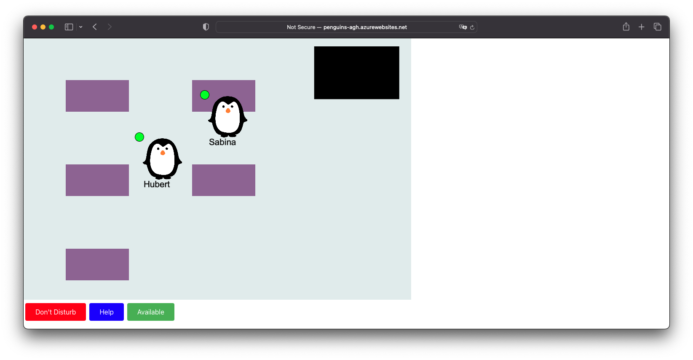
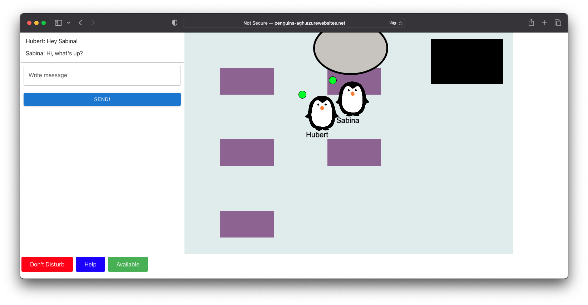
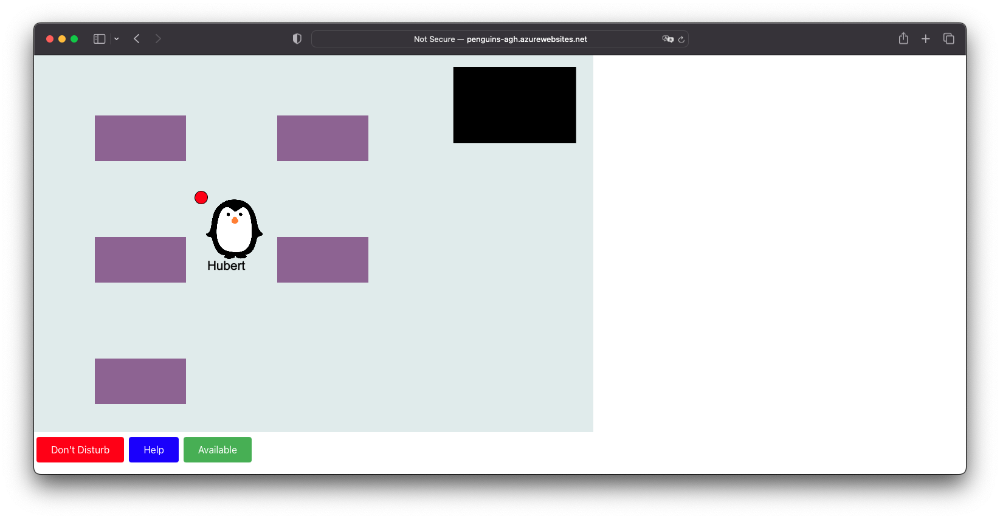
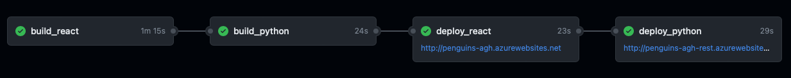
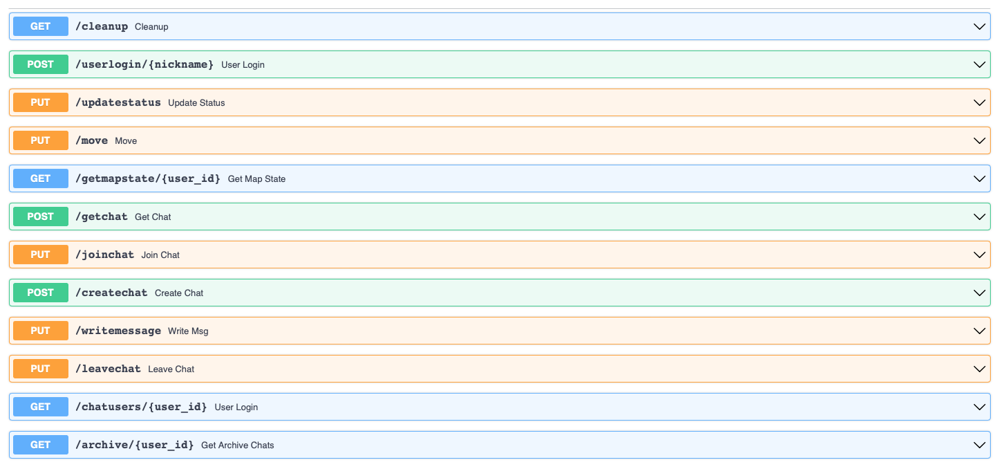
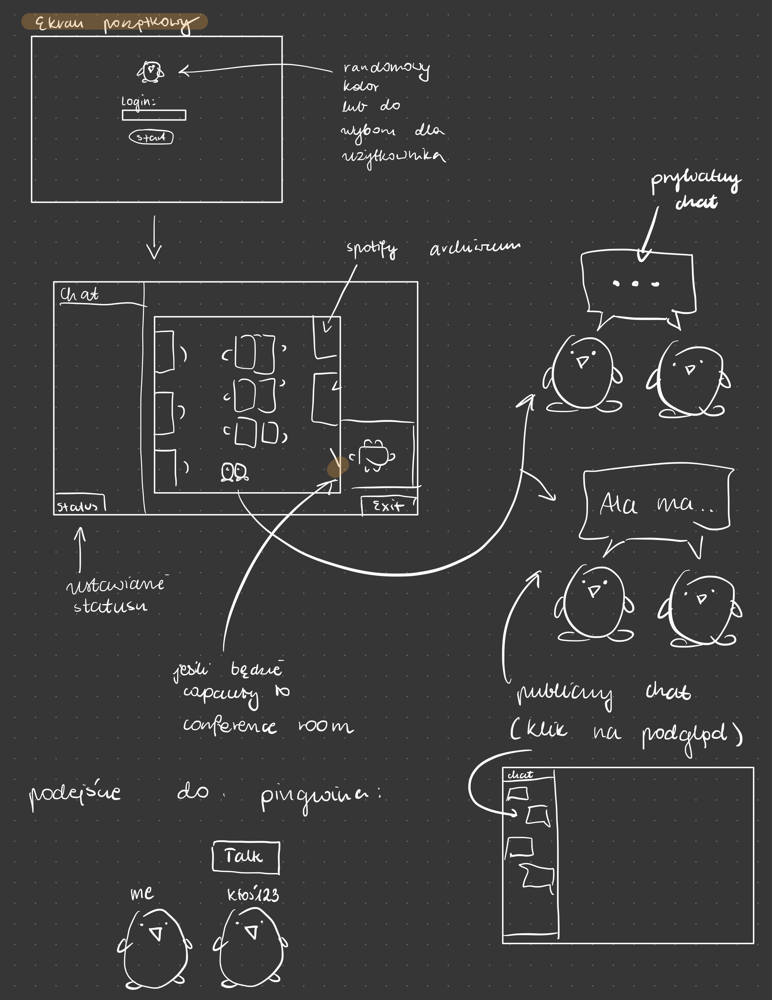
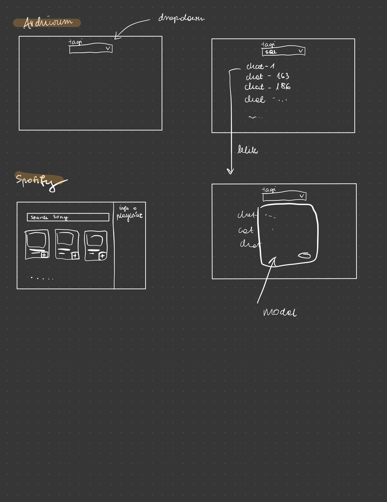

# Penguins documentation

The application is available at http://penguins-agh.azurewebsites.net.

Penguins is a project created for an AGH organized hackathon, where the given topic was "games and AI". 
We were given direct instructions by our client what exactly is expected.

Our project consisted of creating a web application with a virtual office for employees working remotely. 
Each of the users was supposed to be able to define the nickname of the character that could be moved around the room.
Characters could talk to each other publicly or privately. Public conversations could be overheard. Each of the conversations could be joined by creating a group conversation.
There was supposed to be one interactive station on the map, e.g. a conversation archive, where all our public and private conversations were available.

## Project idea

There was an idea to bring together a group of penguins to see if they could communicate with each other through chat in a virtual office while working together.

This idea is the basis of our project - creating a virtual environment that would allow users to move around on the map and also to chat with other users when we are close to each other.

## Screenshots

### Login



To enter the office, it was enough to enter your nickname - it did not have to be unique.

### Office



The character was moved around the office using the arrow keys. In the upper right corner was the conversation archive where all the chats were saved.

### Chat



To talk to the other user, you had to get close to the character. 
The public chat was also visible to other users in the office. 
Private chat was not visible to others.

### Statuses



Every user has the status Available by default. 
If you did not want to be disturbed, you could set the status to Don't Disturb - it made it impossible to start any conversation with you.
In case you needed help, you could change your status to Help.

### Technology stack

Technologies that were used during development can be divided into two categories, backend and frontend.

The backend application used based on Python 3.10, while the frontend application was based on React.

#### Backend
- FastAPI
- Starlette
- Pydantic
- OpenAI

#### Frontend
- React
- PixiJS
- React Redux

### AI aspect

For each of the conversations conducted in the office there was assigned a tag.
It was used in the conversation archive for the identifying of chats.
We have used text-davinci-003 model from the OpenAI to generate the tag.

```
def tag_chat(chat: str) -> str:
    try:
        response = openai.Completion.create(
            model="text-davinci-003",
            prompt=f"Generate one tag for this text:\n\n{chat}",
            temperature=0.5,
            max_tokens=60,
            top_p=1.0,
            frequency_penalty=0.8,
            presence_penalty=0.0
        )
    except:
        return "Error"

    text_response = response["choices"][0]["text"]
    tag = text_response.split("#")[-1]

    return tag
```

#### CI/CD

We have decided to use Github repository for the code of our applications. 
The main branch was configured to be protected from direct pushes.
The only way to push changes was to create a pull request, from a separated branch, with a minimum 1 required reviewer.

As for the continuous deployment we used Github Actions with Azure Web App Service.



The workflow was composed of building and deploying Python and React application. 
It was triggered automatically with every incoming change on the main branch.

### Project structure

#### Backend

The backend side of our project was a REST API server used for a communication with the frontend application and local data storage.
Due to time constrains we used Python dicts to store data on the server, instead of a database.
Endpoints contained logic for data processing and were called by the frontend depending on circumstances.

Following endpoints were implemented:



#### Frontend

The frontend application was written in React with PixiJS and React Redux libraries.

### User Interface mockups

#### Login and Office views



#### Archive and Spotify views

